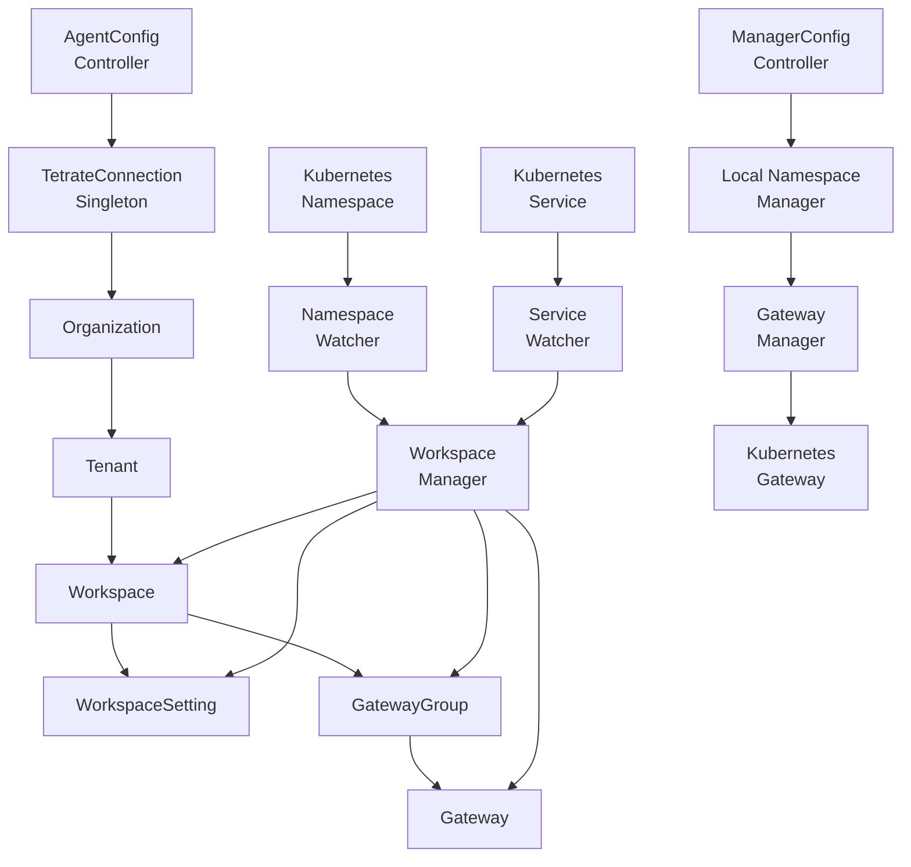
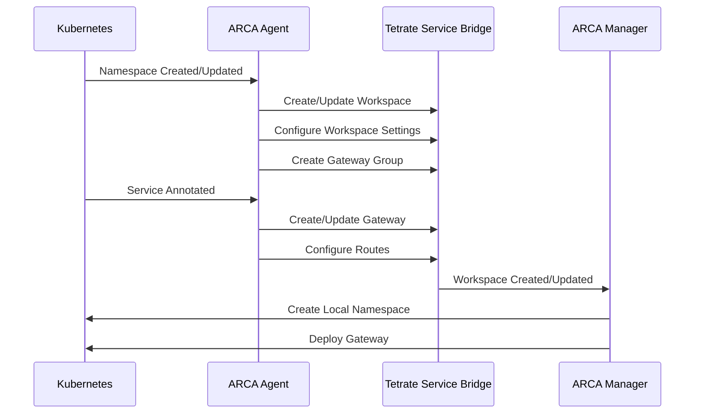

# Project ARCA - Automated Resource and Configuration Assistant

ARCA is a Kubernetes operator that automates the management of Tetrate Service Bridge (TSB) resources and configurations.

## Architecture



## Resource Flow



## Components

### ARCA Agent
The agent component manages TSB resources:
- Watches namespaces and services
- Creates and manages TSB workspaces
- Configures workspace settings
- Sets up gateway groups and gateways

### ARCA Manager
The manager component handles local Kubernetes resources:
- Creates namespaces based on TSB workspaces
- Deploys and configures gateways
- Manages service exposure

## Features

1. **Automated Workspace Management**
   - Label-based namespace discovery
   - Automatic workspace creation
   - Workspace settings configuration
   - Gateway group management

2. **Service Exposure**
   - Annotation-based configuration
   - Automatic gateway deployment
   - Traffic routing setup
   - Status feedback

3. **Gateway Management**
   - Unified gateway deployment
   - East-west gateway configuration
   - Gateway group organization
   - Traffic policy management

## Usage

### Service Exposure
Add annotations to your Kubernetes service:
```yaml
apiVersion: v1
kind: Service
metadata:
  name: my-service
  annotations:
    arca.io/expose: "true"
    arca.io/domain: "myapp.example.com"
    arca.io/path: "/api"
spec:
  ports:
    - port: 80
      targetPort: 8080
  selector:
    app: my-app
```

### Namespace Management
Label namespaces for ARCA management:
```yaml
apiVersion: v1
kind: Namespace
metadata:
  name: my-namespace
  labels:
    arca.io/managed: "true"
```

## Installation

1. Install CRDs:
```bash
kubectl apply -f helm/crds/
```

2. Install ARCA Agent:
```bash
helm upgrade --install arca-agent ./helm -n arca-system --create-namespace
```

3. Install ARCA Manager:
```bash
helm upgrade --install arca-manager ./helm -n arca-system --create-namespace
```

## Configuration

### Agent Config
```yaml
apiVersion: operator.arca.io/v1alpha1
kind: AgentConfig
metadata:
  name: default
spec:
  discoveryLabel: "arca.io/managed=true"
  tetrate:
    endpoint: "https://tsb.example.com"
    apiToken: "your-token"
    organization: "tetrate"
    tenant: "arca"
    clusterName: "cluster1"
```

### Manager Config
```yaml
apiVersion: operator.arca.io/v1alpha1
kind: ManagerConfig
metadata:
  name: default
spec:
  discoveryLabel: "arca.io/managed=true"
  tetrate:
    clusterName: "cluster1"
```

## Development

### Prerequisites
- Python 3.9+
- Docker
- Kubernetes cluster
- TSB access

### Testing
Run tests:
```bash
task test
```

### Building
Build and deploy:
```bash
task release-now
```

## API Reference

### Annotations
| Annotation | Description | Example |
|------------|-------------|---------|
| `arca.io/expose` | Enable gateway exposure | `"true"` |
| `arca.io/domain` | Domain for the service | `"myapp.example.com"` |
| `arca.io/path` | Path prefix | `"/api"` |

### Labels
| Label | Description | Example |
|-------|-------------|---------|
| `arca.io/managed` | Enable ARCA management | `"true"` |
| `arca.io/workspace` | Associated workspace | `"workspace-name"` |

## Contributing
1. Fork the repository
2. Create a feature branch
3. Commit your changes
4. Push to the branch
5. Create a Pull Request

## License
[MIT License](LICENSE)